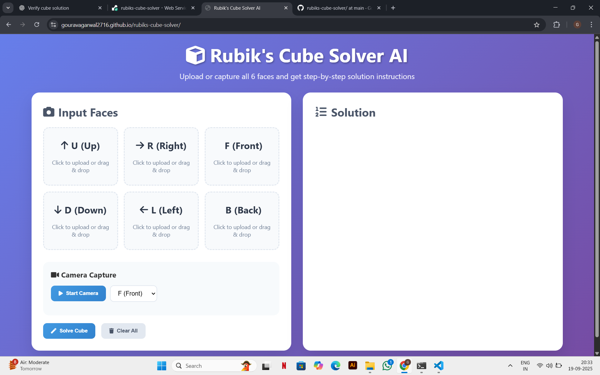

# 🧩 Rubik’s Cube Solver

A full-stack **Rubik’s Cube Solver** that lets users input a scrambled cube state and generates an optimized step-by-step solution.  
Built with a **Python Flask backend** for solving logic and a **HTML/CSS/JavaScript frontend** for user interaction.  
Deployed with **Render (backend)** and **GitHub Pages (frontend)**.  

---

## 🌐 Live Demo
- **Frontend (GitHub Pages):** [Try it here](https://gouravagarwal2716.github.io)  
- **Backend (Render API):** [API Endpoint](https://rubiks-cube-solver-qyjc.onrender.com/solve)  

---

## ⚙️ Features
- Input cube state directly via web interface.
- Get **step-by-step solution moves** instantly.
- Full-stack deployment with Flask + GitHub Pages + Render.
- Clean and simple UI with responsive design.

---

## 🛠 Tech Stack
- **Frontend:** HTML, CSS, JavaScript  
- **Backend:** Python, Flask  
- **Deployment:** Render (backend), GitHub Pages (frontend)  

---

## 🚀 How It Works
1. User enters a cube state.
2. Frontend sends the cube state to the Flask backend.
3. Backend runs the solver algorithm and returns the optimized move sequence.
4. Solution is displayed step-by-step in the frontend.

---

## 📸 Screenshots




---

## 🏃 Run Locally

Clone the repo:
```bash
git clone https://github.com/gouravagarwal2716/rubiks-cube-solver.git
cd rubiks-cube-solver
